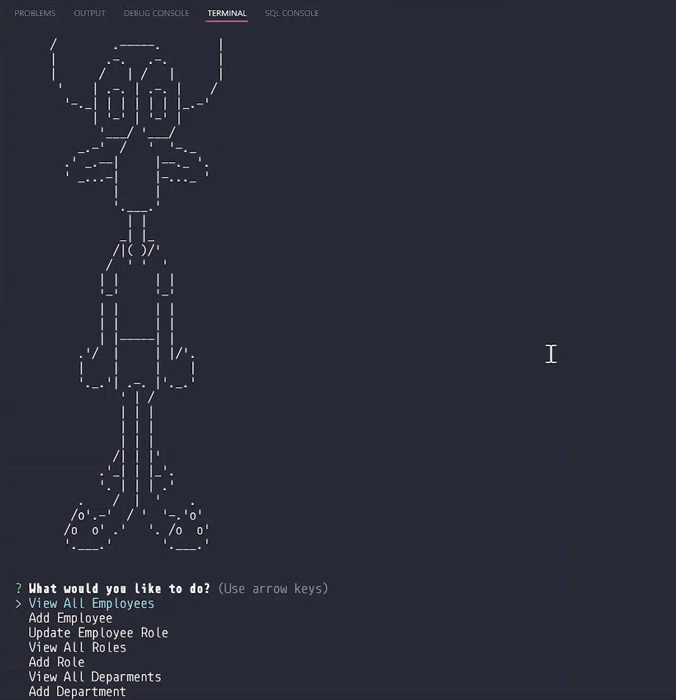

# BigBrother

  Track your employees. Even TVs have mics.
  
#### Description
  ``` 
  Employee management in mysql database
  ```

## Table of Contents:
- [Title](#BigBrother)
  * [Description](#description)
- [Installation Instructions](#installation%20instructions)
- [Usage](#usage)
  * [Screenshot](#screenshot)
  * [Video](#video)
- [Licenses](#licenses)
- [Contributing](#contributing)
- [Testing](#testing)
- [FAQ](#faq)

## Installation Instructions
```
source schema and seed the database, then run the server in the node environment.
```

## Usage
```
arrow keys for selection and enter to confirm selection
```

#### Screenshot


#### Video


https://user-images.githubusercontent.com/57278348/159139431-5c5308ca-af55-4481-bacd-618f0f89caed.mp4


## Licenses


## Contributing
App works thanks to Me, myself and I

## Testing
Danila tested the app.

## FAQ

For questions you may contact me at [danila.vpopov@gmail.com](danila.vpopov@gmail.com) :thinking:

In the meantime you can take a look at my [GitHub Profile](https://github.com/corhydare) :smirk:
[](https://github.com/corhydare)
  
